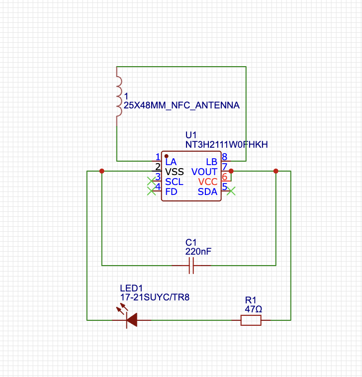
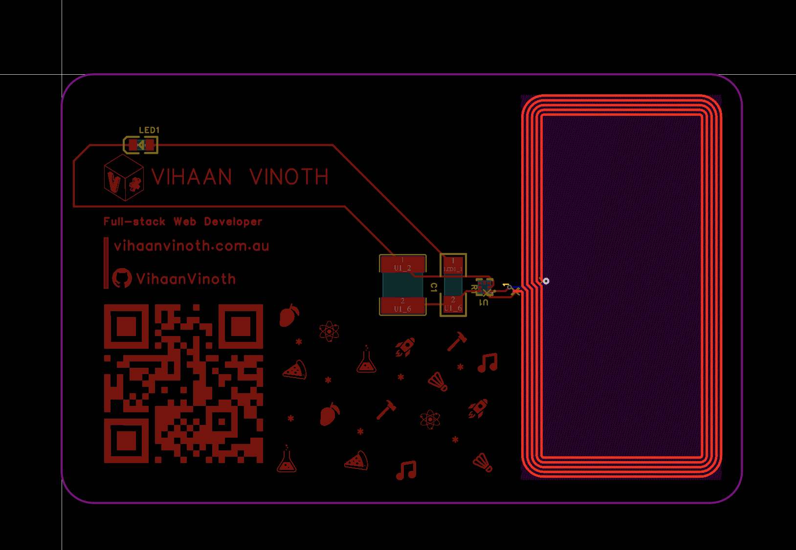
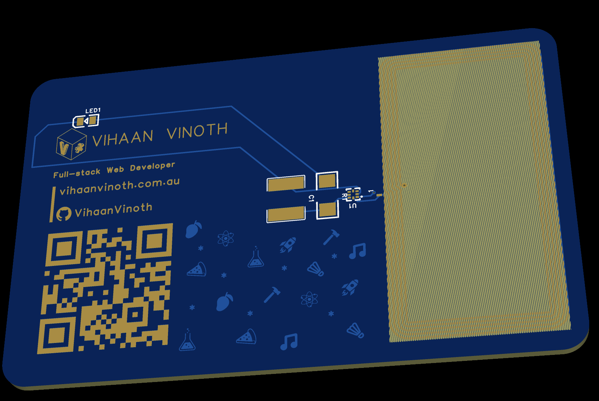

# Vert's Hacker Card
I made a simple business card that **is** literally a PCB. It includes NFC support and using your phone you can simply tap the card and get access to my website (https://vihaanvinoth.com). 

## Features
- I gave the main text and QR code a shiny golden finish via TopLayer + TopSolderLayer
- The small icons have dark texture via TopLayer
- The NFC Reader design has a translucent yellow colour using TopSolderLayer

## Schema

## PCB

## Schema

## BOM

| NO. | Quantity | Comment | Footprint |
| --- | -------- | ------- | --------- |
| 1 | 1 | 25X48MM_NFC_ANTENNA | 25X48MM_NFC_ANTENNA |
| 2 | 1 | 220nF | C2220 | 
| 3 | 1 | 17-21SUYC/TR8 | LED0805-R-RD
| 4 | 1 | 47Ω | R0207 |
| 5 | 1 | NT3H2111W0FHKH | XQFN-8_L1.6-W1.6-P0.50-BL_NT3H2111W0FHKH |
                                    
                                    
                                    
                                    